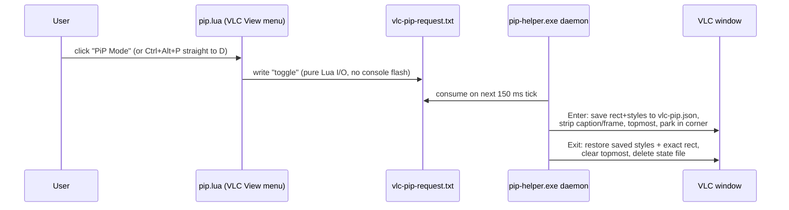
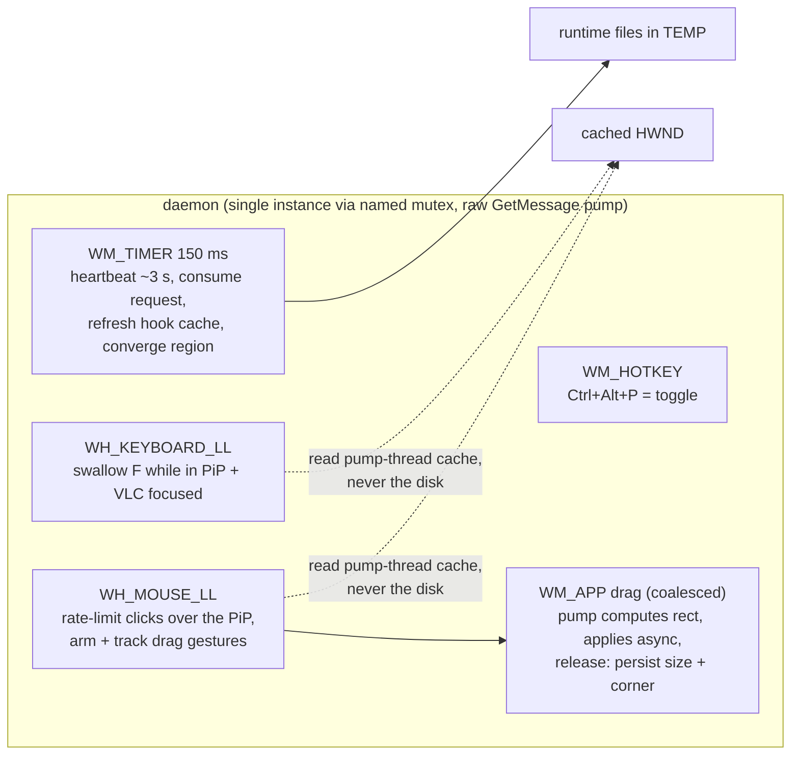

# Architecture

VLC's Lua extension API has no window-management surface, so the extension is only a trigger. All real work happens in `pip-helper.exe` - a ~159KB Rust daemon (GUI subsystem, zero runtime dependencies, `windows-sys` only) that reshapes VLC's **own** top-level window via Win32. No mirroring, no second player: it is the genuine hardware-decoding window, so PiP adds zero latency and every VLC shortcut keeps working.

## Toggle flow



A **valid** `%TEMP%\vlc-pip.json` is the single source of truth for "in PiP" - menu and hotkey both call the same `toggle`, so they can never desync. The state records the owner PID; a recycled window handle (VLC died, another app got the HWND) reads as stale and is deleted on sight.

## Daemon internals



Key mechanisms, each earned by a v1 bug (details in [SPEC.md](SPEC.md) §7-8):

- **Fullscreen prevention is preventive, not reactive.** A poll-and-snap-back guard flickers; instead the mouse hook swallows every button-down within double-click time/rect of the last *allowed* down, so the OS can never synthesize `WM_LBUTTONDBLCLK` (swallowing only the 2nd click let clicks 1+3 pair - triple-click fullscreened).
- **Hooks never touch the disk.** File I/O in a low-level hook risks `LowLevelHooksTimeout`, after which Windows silently removes the hook. Hooks read an HWND cache refreshed on the pump thread.
- **Minimal look** (menu/controls hidden, like Ctrl+H) clips the window to VLC's video child via `SetWindowRgn`, growing the window by the chrome delta so the visible video is exactly the target size. VLC re-fits the child asynchronously, so the converger acts only on measurements stable across two ticks, with a 0-300px chrome sanity clamp.
- **The heartbeat file** (`vlc-pip-daemon.alive`, epoch + arming flags, rewritten ~3 s) is how `pip.lua` decides liveness - a force-killed daemon can't delete a marker file, so existence alone is not liveness.
- **Fullscreen handoff (v2.1.1).** Entering PiP from a fullscreen VLC first makes VLC itself leave fullscreen: external reshaping alone would leave VLC's internal fullscreen state and its fullscreen-controller strip on screen, and save the fullscreen rect as the restore state. Esc is posted to every vout window of the process (their event thread takes keys regardless of focus or visibility - fullscreen hosts the vout embedded or as an invisible desktop-parented top-level), and only once no modifier key is physically held: VLC reads the physical modifier state, so the triggering hotkey's own chord would turn Esc into Ctrl+Alt+Esc. The daemon defers the enter across timer ticks (the pump must never block, see hooks above) until the caption is back for two consecutive ticks; repeat toggles while it waits are no-ops, so an impatient re-press cannot cancel the invisible enter. The window is cloaked (`WS_EX_LAYERED`, alpha 0) for the whole transition - Qt re-shows it on leave-fullscreen so hiding cannot win - making the switch read as fullscreen-vanishes, PiP-appears, with no intermediate windowed flash ([SPEC.md](SPEC.md) §7).
- **Drag gestures (v2.1) ride the same mouse hook.** An allowed button-down over the PiP arms a gesture (interior = free move, outer 16px band of the visible rect = aspect-locked resize); the hook only stores the latest cursor position and posts one coalesced `WM_APP` message with a generation counter (a rapid release-and-repress can't mix stale deltas), and the pump computes and applies the rect - finalizing on release from its own computed rect, never `GetWindowRect` after the async `SetWindowPos` - and persists size + nearest corner to `config.txt`. Full contract: [SPEC.md](SPEC.md) §12.
- **Close-in-PiP heal (v2.1).** VLC closed while in PiP saves the PiP geometry as its own; the daemon keeps the stale state as a pending-restore record and re-applies the pre-PiP rect once a new player window appears, deleting the state only when the rect sticks ([SPEC.md](SPEC.md) §12).

## Layout

| Piece | Lives at |
|---|---|
| `pip.lua` trigger extension | `%APPDATA%\vlc\lua\extensions\` (only the .lua - a stray exe breaks VLC's extension scan) |
| `pip-helper.exe` | `%APPDATA%\vlc\pip\` |
| Autostart | `shell:startup\VLC PiP Daemon.lnk` → `pip-helper.exe daemon` |
| Runtime state | `%TEMP%\vlc-pip*` (state, request, heartbeat, status, crash) |
| Persisted size/corner | `%APPDATA%\vlc\pip\config.txt` (written on drag release) |

Source: `helper/src/` - `main.rs` (CLI + panic-to-crash-file), `daemon.rs` (pump + hooks), `native.rs` (Win32 reshape + region), and pure `state.rs` / `options.rs` / `geometry.rs` / `request.rs`; all unit tests live in `src/tests.rs`. CLI modes: `toggle|enter|exit|status|daemon|stop` (`status` writes `%TEMP%\vlc-pip-status.json`; a GUI-subsystem exe's stdout is unreliable).

## Development

```powershell
cargo test --manifest-path helper\Cargo.toml          # 43 unit tests (pure logic)
powershell -ExecutionPolicy Bypass -File scripts\smoke-test.ps1   # 40 end-to-end checks against live VLC
```

The smoke test is the acceptance gate: it drives enter/exit through the request file and the real hotkey, spam-clicks the PiP, and asserts exact rect restore. [SPEC.md](SPEC.md) is the full behavioral contract, including the v1-earned gotchas that must not regress.
