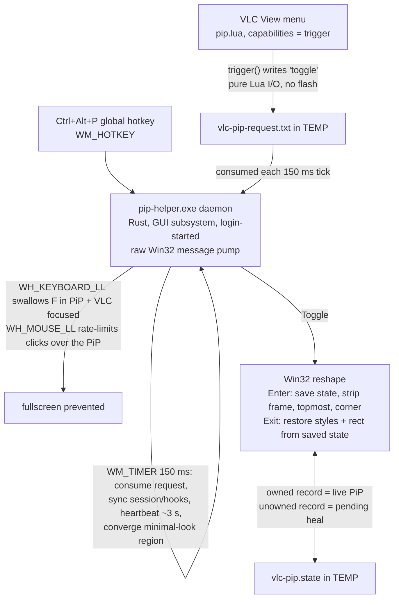

# VLC Picture-in-Picture for Windows - Build Spec

This is the behavioral contract for a Windows **Picture-in-Picture** that reshapes the real VLC window into a borderless, always-on-top mini player and restores it exactly. Drag gestures and size/corner persistence are specified in §12.

Target: VLC 3.0.x on Windows 10/11 x64. VLC 3.0.23 and Windows 11 are verified; primary use is single-monitor.

`scripts/smoke-test.ps1` plus the unit suite gate every change. Runtime formats are internal since v2.1.2 but remain pinned because the helper, scripts, and `pip.lua` consume them.

---

## 1. Goal & non-goals

**Goal**
- Toggle the current VLC window into a small, borderless, always-on-top window in a screen corner ("PiP"), then restore its exact size, position, border, and original topmost state.
- Trigger from **VLC's View menu** and a **global hotkey** (Ctrl+Alt+P), consistently.
- **Zero added video latency / quality loss** (it's the real decoding window, not a mirror).
- **No terminal/console flashes** on toggle.
- While in PiP, **don't let the video go fullscreen** (F key and double/triple/spam-click).
- Toggling PiP **on a fullscreen VLC** is as instant as any toggle, and toggling back returns to fullscreen (v2.1.1); VLC's fullscreen-controller strip stays off the screen while the PiP lives.
- **Minimal look** (default on): hide VLC's menu bar + control bar - exactly the Ctrl+H view - so PiP shows just video.

**Non-goals**
- Mirroring/duplicating the video (DWM thumbnail) - rejected: adds >=1 frame latency and is read-only.
- A separate standalone player - rejected: must reuse VLC's features/codecs/keybindings.

---

## 2. Core design decision

**Reshape VLC's own top-level window via Win32.** A small external helper:
- removes the title bar + sizing border (`SetWindowLongPtrW(GWL_STYLE)` clearing `WS_CAPTION | WS_THICKFRAME | WS_MAXIMIZE`, followed by `SetWindowPos(..., SWP_FRAMECHANGED)`),
- sets it always-on-top (`HWND_TOPMOST`) and parks it in a work-area corner,
- restores saved styles + rect on exit.

VLC's Lua extension API **cannot** do any of this (no window-geometry API). So the Lua extension only acts as a trigger; all Win32 work happens in the compiled helper.

---

## 3. Hard constraints & verified facts (read before coding)

### VLC Lua extensions
- Lua extensions have **no window-management API**. `os.execute`/`io.popen` work but flash a console (cmd.exe) - the menu must **never spawn a process** on the normal path.
- `capabilities = {"trigger"}` → VLC calls **`trigger()` on every click**, no activation/checkmark state. ← USE THIS (gotcha #1).
- **The extension probe runs the chunk top level** to read `descriptor()`. Any top-level error (e.g. `os.getenv(x) .. "..."`) makes the extension silently vanish from the menu. Env lookups stay lazy inside functions.
- **Only `.lua` belongs in the extensions folder** - a stray `.exe` there breaks the extension scan.

### Win32 reshape
- After `SetWindowLongPtrW(GWL_STYLE, ...)` you **must** `SetWindowPos(..., SWP_FRAMECHANGED)` or the frame change won't apply.
- Save and restore both `GWL_STYLE` and `GWL_EXSTYLE`, plus the window rect.
- VLC 3.x embedded video is a `WS_CHILD` window (class prefix `"VLC video main"`) inside the Qt main window; resizing the parent re-fits the child **asynchronously** (see §8 debounce).

### Daemon message loop
- Raw Win32 thread message pump: `GetMessageW` loop; `RegisterHotKey` and `SetTimer` with NULL hwnd deliver `WM_HOTKEY`/`WM_TIMER` to the thread queue (no window needed).
- **No file I/O inside LL hook callbacks**: exceeding `LowLevelHooksTimeout` makes Windows SILENTLY remove the hook - the fullscreen-block guarantee dies with no error. Hooks read a cache refreshed on the pump thread; hook callbacks dispatch on that same thread, so no synchronization is needed.
- The exe is **GUI subsystem** (`#![windows_subsystem = "windows"]`): no console ever; stdout is invisible when Explorer-launched, so all machine-readable output goes through files (§6).

---

## 4. Architecture



Toggle = `owns_state` ? Exit : Enter. Menu and hotkey both call the same path.

---

## 5. Components

### 5.1 `pip.lua` (VLC extension)
- `descriptor()` returns `capabilities = { "trigger" }`, title "PiP Mode".
- `trigger()` → ensure daemon alive (heartbeat check, §6.3), write `"toggle"` to the request file; errors go to `vlc.msg.err`.
- Fallback only: if the daemon is dead, `os.execute('start "" "<exe>" daemon')` (the sole case that may flash; normally never fires because of login auto-start).
- Installs to `%APPDATA%\vlc\lua\extensions\pip.lua` (ONLY the .lua here).

### 5.2 `pip-helper.exe` (Rust binary crate at `helper/`)

Single binary crate, no lib split. `windows-sys 0.61` is the only dependency; file formats are hand-rolled (§8 gotcha R2).

Modes (argv[1], ASCII-lowercased; default `toggle` when absent). Options parsed from the remaining args; `w=`/`h=` accept only positive values (like `c=` normalization: a 0/negative size would park an invisible topmost window the converger can never fix):
- `toggle` | `enter` - one-shot Win32 action, then if it **entered** PiP with `min=1`: 6 × { sleep 150 ms; maintain_region } to converge the minimal look. Exit 0 on success, 1 on failure.
- `exit` - restore; no region loop. Exit 0/1.
- `status` - print status JSON to stdout (best effort) AND write it to `%TEMP%\vlc-pip-status.json` (the reliable channel). Always exit 0.
- `daemon` - run the message loop (single instance via named mutex `"VlcPipDaemon"`; a second instance exits 0 silently, touching no files). Exit 0.
- `stop` - write `"stop"` to the request file. Exit 0 (1 if the write fails; v1 crashed to 3 there).
- anything else - "unknown mode" to stderr, exit 2.
- Every mode first calls `SetProcessDpiAwarenessContext(PER_MONITOR_AWARE_V2)`.
- A panic anywhere → hook writes `%TEMP%\vlc-pip-crash.txt` (message + file:line) and the process exits 3.

### 5.3 Install layout
```
%APPDATA%\vlc\lua\extensions\pip.lua                         (extension)
%APPDATA%\vlc\pip\pip-helper.exe                             (helper, OUT of extensions)
shell:startup\VLC PiP Daemon.lnk  ->  pip-helper.exe daemon  (login auto-start, no flash)
```

---

## 6. Runtime file contracts (all in `%TEMP%`, truncate-write, UTF-8 no BOM)

### 6.1 `vlc-pip.state` - live session or pending reopen heal
Created by Enter and updated on drag release: one newline-terminated line of exactly 13 whitespace-separated tokens. The fields, in order, are `hwnd x y w h style ex_style target_w target_h corner margin min pid`:
```
66112 100 200 1000 640 349110272 256 480 270 br 16 1 12345
```
Wire types: `hwnd`/`style`/`ex_style` signed i64; `x y w h target_w target_h margin` i32; `corner` one of `br bl tr tl` (unknown reads as `br`); `min` `1|0`; `pid` u32. The three native-width values are held as `isize` internally: reads parse signed i64 then checked-convert, and writes cast back to i64, preserving this x64 wire format. `x..ex_style` are the pre-PiP restore data; `target_w..min` are the options in effect at Enter (so daemon and one-shot CLI converge on the same geometry); `pid` is the owner process.
- **Any** parse failure (missing trailing newline, wrong token count, bad number) loads as `None` = "not in PiP" - the benign failure mode is the point. The trailing newline is the torn-write sentinel: a truncated write loses it, so a partial line (which could carry a numeric prefix of `pid`) can never parse.
- **Ownership (`owns_state`)**: a valid record is a live PiP iff `pid != 0` and `GetWindowThreadProcessId(hwnd) == pid`. A destroyed or recycled HWND yields 0 or a foreign owner, so handle validity alone is insufficient. An unowned valid record is pending reopen heal (§12); explicit Exit drops it and Enter overwrites it, while `in_pip`/`status` leave it untouched. Terminal cleanup and successful overwrite clear the recorded controller veil only for fullscreen-origin state. Delete failures are retried by the next caller.

### 6.2 `vlc-pip-request.txt` - command channel into the daemon
Bare word, trimmed on read: `toggle` | `enter` | `exit` | `stop` (case-sensitive). Consumed (read + delete) every 150 ms tick; read errors leave the file for the next tick; empty file is deleted and ignored. On daemon start, a pre-existing request is discarded **only if it is `stop`** (a `pip-helper stop` with no daemon alive leaves one that would kill the fresh daemon on its first tick; a queued user toggle survives).

### 6.3 `vlc-pip-daemon.alive` - heartbeat + arming diagnostics
Single line, no newline, rewritten on start and then every >3000 ms (checked each 150 ms tick):
```
{unix_seconds_utc} pid={pid} hotkey={0|1} timer={0|1} kb={0|1} mouse={0|1}
```
`hotkey`/`timer` = whether registration succeeded at daemon start; `kb`/`mouse` = whether each session hook slot is currently non-null (`0 0` is normal while idle). Hook failures are nonfatal: a failed install retries at the next session sync, and a failed unhook keeps its slot for another retry. Write failures are swallowed and retried next beat: NEVER let the heartbeat kill the pump. Deleted on clean daemon exit AND by the crash handler when the daemon panics (else pip.lua would treat the dead daemon as alive for up to 15 s and drop menu toggles).
**Consumer contract (pip.lua)**: reads the leading number with Lua `read("*n")`; alive iff the parse yields nil (mid-truncate read = daemon IS alive, never respawn) OR `abs(os.time() - ts) < 15`. So the line MUST start with the epoch number.

### 6.4 `vlc-pip-status.json` - `status` mode output (stdout is unreliable for a GUI exe)
Exactly (key order, lowercase booleans): `{"found":false}` or
```
{"found":true,"hwnd":N,"x":N,"y":N,"w":N,"h":N,"caption":B,"topmost":B,"inPip":B,"minimal":B}
```
`caption` = `(style & WS_CAPTION) == WS_CAPTION` (BOTH bits of 0x00C00000); `topmost` = `exstyle & WS_EX_TOPMOST != 0`; `minimal` = the main VLC window has a nonempty region (`GetWindowRgn` + `GetRgnBox`; every region set on that window is nonempty). The smoke test drives everything through this file.

### 6.5 `vlc-pip-crash.txt` - panic message + location, best-effort write from the panic hook; process exits 3. The only diagnostics channel.

---

## 7. Behavioral contract - Win32 sequences

### find_player
1. Toolhelp process snapshot → set of PIDs whose exe name == `vlc.exe` (case-insensitive). Empty → null.
2. `EnumWindows`: skip invisible; skip PIDs not in the set; skip **empty titles** (filters VLC's hidden/extension windows); first window whose title contains `"VLC media player"` (case-insensitive) wins and stops enumeration; else track the biggest-area window as fallback.

### enter(h, o) - all steps in this order
1. Guard: null h or already InPip → false.
2. Reject a nonpositive target before changing the window.
3. `IsIconic(h)` → `ShowWindow(h, SW_RESTORE)` (else both the chrome measurement and restore rect can be stale/off-screen).
4. Read the work area and, with `min=1` and a video child present, the client-relative chrome around the child (menu above, controller below - Qt client-area widgets, so the offsets survive the border strip; sanity: per-axis sums within 0..=300, else use the plain path). Precompute the complete landing rect and optional region with checked arithmetic. An unrepresentable coordinate or size returns false before state save or PiP mutation.
5. Read rect, `GWL_STYLE`, `GWL_EXSTYLE`, owner pid; reject a nonpositive or unrepresentable restore size; **save state before any PiP mutation**. A successful stale-state overwrite clears its fullscreen controller veil. For a new fullscreen-origin state, hide any currently visible controller and apply its persistent empty-region veil before reshaping.
6. Strip `WS_CAPTION | WS_THICKFRAME | WS_MAXIMIZE` (WS_MAXIMIZE too: a zoomed window keeps IsZoomed, so Win+Down/Aero would snap the PiP back to Qt's normal placement rect).
7. Apply the precomputed corner from the **work area** (`GetMonitorInfoW(MonitorFromWindow(h, MONITOR_DEFAULTTONEAREST)).rcWork`, taskbar excluded): `left = work.left+margin; top = work.top+margin; right = work.right-w-margin; bottom = work.bottom-h-margin`; `tl/tr/bl` as named, anything else = `br`. With measured chrome, one `SetWindowPos(h, HWND_TOPMOST, vx-cl, vy-ct, w+cl+cr, h+ct+cb, SWP_FRAMECHANGED|SWP_SHOWWINDOW)` followed immediately by the region `(cl, ct, cl+w, ct+h)` - the PiP lands fully formed, no visible grow-then-clip pass (the converger only verifies). Without chrome (not playing, `min=0`, garbage measurement): plain `SetWindowPos(..., o.w, o.h, ...)` and the converger takes over.
8. **Rollback on failure** (e.g. UIPI vs elevated VLC): restore the original style, clear the fullscreen controller veil, delete state, never claim in-PiP (the main-window region is only applied after a successful SetWindowPos).

### exit() - all steps in this order
1. Load state; null → false. `owns_state` fails → clear a fullscreen-origin controller veil, delete state, false.
2. `SetWindowRgn(h, null, true)` FIRST - drop the minimal-look clip before restoring.
3. Restore `GWL_STYLE`, then `GWL_EXSTYLE`.
4. `SetWindowPos(h, saved ExStyle & WS_EX_TOPMOST ? HWND_TOPMOST : HWND_NOTOPMOST, saved rect, SWP_FRAMECHANGED|SWP_SHOWWINDOW)` - honors the user's own always-on-top.
5. Iff `ok || !IsWindow(h)`, clear the controller veil for a fullscreen-origin state and delete state. A failed restore on a still-live window keeps both state and veil so the next toggle retries.

### Fullscreen-origin PiP (v2.1.1)
Entering PiP from a fullscreen VLC is the same immediate reshape as any other enter - the PiP appears at the keypress. **VLC's internal fullscreen state stays ON for the whole PiP session.** Clearing it first (post Esc, wait for Qt's windowed restore) cost the user ~0.5-1s of dead screen; the reverse order desyncs Qt, which restores its windowed geometry only from an UNTOUCHED fullscreen window - after an external reshape, Esc left a captionless window at the PiP rect with the menus grown back (verified live). A fullscreen-origin PiP is recognized by its saved pre-PiP style: `WS_CAPTION` fully absent (an iconic VLC is restored before the snapshot, as always).
- **While such a PiP lives**: VLC's fullscreen controller strip - a separate topmost window (class prefix `Qt5QWindowToolSaveBits`) that would otherwise pop up over the desktop on hover - is hidden by enter() itself BEFORE the reshape lands (the user was likely just hovering the fullscreen video, so the strip is on screen at toggle time). Enter then applies an empty window region to every matching controller, including hidden strips. Each daemon tick idempotently restores that `NULLREGION` if VLC recreates or reshapes a controller, preventing hover blink without repeatedly changing an intact veil. The keyboard hook swallows **Esc** (in addition to F) while VLC is focused: either key would make Qt leave fullscreen underneath the reshape.
- **Exit restores the saved fullscreen style + rect verbatim** - the ordinary exit path, no special casing. On terminal success, it clears only the empty controller region and does not show the strip; VLC shows it on its next hover. The user came from fullscreen and gets fullscreen back, and VLC's internal state matches its window again; leaving fullscreen afterwards is VLC's own untouched restore, so the original windowed rect survives the whole trip.
- **Dissolve on media end / stop**: VLC leaves fullscreen internally BY ITSELF when playback ends or is stopped - no input involved - and its re-layout balloons the window to Qt's idea of windowed geometry within ~a tick of the vout dying (verified live). The tick watches for that signature on fullscreen-origin sessions (vout gone AND the rect moved off the last rect seen with live video; runs regardless of `min`): the PiP session then dissolves - frame styles back at Qt's chosen rect, controller veil cleared, state deleted. Stock VLC lands windowed after fullscreen playback ends too, and the saved fullscreen rect must never be restored onto an internally windowed VLC. A toggle after the dissolve is a fresh windowed-origin enter.
- **Heal**: a fullscreen-origin record (§12) has its controller veil cleared and is deleted, never applied - its rect is the fullscreen rect, and Qt, believing fullscreen throughout, persisted the true windowed geometry itself.
- **Accepted edges**: an exit racing the dissolve inside one tick can still restore the fullscreen shell; a `min=0` fullscreen-origin PiP exposes VLC's menu bar, whose fullscreen items can desync Qt (the dissolve only covers the vout-death paths); without the daemon (one-shot CLI only) none of the guards or the dissolve run, as for every hook-based guarantee.

### maintain_region() - minimal look, converging per-tick (daemon timer + one-shot loop)
Cross-tick state: the previous (window, child) rects held as an Option (None = reset; reset on missing/stale state, no child, and after our own resize), plus the fullscreen-origin dissolve baseline, heal retry counter, and bounded absent-process snapshot wait. A drag clears only the stability debounce, preserving the dissolve and heal fields.
The function reports a terminal dissolve/heal only after the state file is absent (`remove_file` success or NotFound). A removal failure preserves the fullscreen dissolve baseline or heal terminal state and reports false so the next tick retries. On success, the daemon conditionally reloads state and re-syncs its cache/hooks in the same tick; ordinary ticks keep one shared state-file load, while the one-shot converger ignores the signal.
1. Load state; missing → reset, return. Stale → reset, hand to the reopen heal (§12), return. `min=0` → return.
2. Find the video child: first visible child (recursive) whose class starts with `"VLC video main"`. None (playback stopped) → reset, clear region if present, return.
3. **Two-tick stability debounce**: read window + child rects; act only if both are UNCHANGED since the previous tick (VLC re-fits the child asynchronously after our resize; acting on unsettled rects caused perpetual resize thrash in v1). Always record current rects.
4. **Chrome sanity clamp**: chrome = window minus child size; if any dimension is negative or > 300 px → stale rects, return.
5. Nonpositive targets, invalid rect sizes, or unrepresentable checked arithmetic → return. Otherwise, when the child is not at target size (tolerance ±2 px), recompute the corner for the video, resize the window to `target + chrome` positioned so the CHILD lands at the corner (`SetWindowPos(h, HWND_TOPMOST, tx, ty, tw, th, SWP_FRAMECHANGED)` - no SWP_SHOWWINDOW here), drop the stored rects (our own resize), return.
6. Child at target: verify the region **box** against the child-relative rect (a live-clipped resize drag leaves an approximate region) and set it on mismatch: `CreateRectRgn` + `SetWindowRgn`; **on failure `DeleteObject` the region - the system owns it only on success**.

### Fullscreen prevention (prevent, don't auto-exit; poll-and-snap-back flickers)
- **Keys** (`WH_KEYBOARD_LL`): swallow iff `code >= 0` AND (WM_KEYDOWN or WM_SYSKEYDOWN) AND hook cache says in-PiP AND the cached hwnd's current owner still equals the cached nonzero pid AND `GetForegroundWindow() == cached hwnd` - for vk == F always, and for vk == Esc when the PiP is fullscreen-origin (see above). Key-ups pass.
- **Clicks** (`WH_MOUSE_LL`) - the rate-limit, exact bookkeeping (last ALLOWED down time+point, swallow_next_up flag):
  - On `WM_LBUTTONDOWN` over the PiP (current owner still equals the cached nonzero pid, and root ancestor of `WindowFromPoint` == cached hwnd): `burst = (evt.time - last_allowed_time <= GetDoubleClickTime()) && |dx| <= SM_CXDOUBLECLK && |dy| <= SM_CYDOUBLECLK`. Burst → set swallow_next_up, swallow. Else record this down as the new ALLOWED reference and pass.
  - On `WM_LBUTTONUP` with swallow_next_up set: clear the flag; swallow only while the cached hwnd still has the cached owner (keeps a valid input stream paired, but a recycled HWND receives no suppression).
  - The reference point is the last **ALLOWED** down - so EVERY down inside the window/rect of the last allowed down is swallowed, and no two clicks the OS actually delivers can pair into `WM_LBUTTONDBLCLK`. (v1 bug: swallowing only the 2nd click let the OS pair clicks 1+3 - TRIPLE click fullscreened.)
  - `GetDoubleClickTime`/`GetSystemMetrics` queried live per event; timestamps are u32 ms with wrapping subtraction.
- Hooks never touch the disk: they read a **pump-thread cache** (the hwnd + pid of a loaded state passing the full owner-PID guard, refreshed before the loop, after every hotkey/timer action, and immediately after terminal maintenance) and revalidate current HWND ownership before every suppression. Deletion of stale files stays in the toggle paths + maintain_region.
- **Hooks are session-scoped.** The pump installs only null hook slots while an owned PiP session is active and unhooks each non-null slot when none is active. Failed installs and unhooks retry at the next sync without duplicate installs. The cache is cleared before unhooking, so a retained hook passes input through. Ending a session resets drag state and only the pending swallowed button-up flag; the last allowed click remains the rate-limit reference across a quick toggle cycle.

### Daemon loop
1. Named mutex `"VlcPipDaemon"` → second instance exits 0 before touching any file.
2. Discard pre-launch `stop` request (only `stop`).
3. Register the hotkey and 150 ms thread timer, retain both success flags, and initialize two null LL-hook slots. Neither registration failure is fatal.
4. Load state and run the full owner-checked session/hook sync before the first heartbeat (a daemon restarted while already in PiP is guarded from the first message).
5. Pump: `WM_HOTKEY` → Toggle + immediate session sync. `WM_TIMER` → consume request (`toggle`/`enter`/`exit` act; `stop` → `PostQuitMessage(0)`), load state + sync, maintain the fullscreen controller veil while a fullscreen-origin PiP is active, maintain_region, conditionally reload + sync if maintenance dropped state, then beat if >3 s. Transient file-I/O errors are swallowed (retry next tick); anything else propagates to the crash handler. The daemon creates no windows and accepts no text input; it handles its `WM_HOTKEY`/`WM_TIMER`/`WM_APP` thread messages directly, so `TranslateMessage` and `DispatchMessageW` are intentionally absent.
6. Cleanup on loop exit: sync to no session (retrying each installed hook once), unregister the hotkey, delete the alive file, and clear heartbeat ownership. A final failed unhook remains until process exit.

---

## 8. Gotchas that caused real bugs (do not repeat)

From v1 development:
1. **Menu/hotkey desync.** VLC's `activate()/deactivate()` checkmark state + separate hotkey state = "many bad states". FIX: `trigger` capability + single state file; both paths call Toggle.
2. **Top-level `os.getenv` in the extension** made it vanish from the menu (probe error). FIX: lazy env lookups.
3. **Exe in the extensions folder** broke the extension scan. FIX: helper lives in `%APPDATA%\vlc\pip\`.
4. **Console flashes**: `os.execute` always flashes via cmd. FIX: request file + login-started GUI-subsystem daemon.
5. **Double-click snap-back flicker**: poll-and-snap-back reacts after VLC fullscreens (big → corner flicker). FIX: mouse-hook swallow - prevent before, not after.
6. **Triple-click fullscreened**: swallowing only the 2nd click let the OS pair clicks 1+3. FIX: rate-limit against the last ALLOWED down (§7).
7. **Ctrl+H via PostMessage/SendInput** is ignored/blind-toggles. FIX: `SetWindowRgn` clip (§7 maintain_region).
8. **Region thrash**: acting on fresh-but-unsettled rects (VLC re-fits the child async) caused perpetual resize. FIX: two-tick stability debounce + chrome sanity clamp.
9. **`start /B` ties the daemon to the launching console.** Launch detached: `start "" "<exe>" daemon`, or the login shortcut.

New, Rust-specific (verified 2026-07-02):
- **R1. `lto` must be set explicitly.** With `codegen-units = 1` and the default `lto = false`, Cargo performs NO LTO at all (Cargo book). The size profile needs `lto = true`.
- **R2. No serde**: measured 125,440 B vs 169,472 B (serde_json) / 174,080 B (nanoserde) for the original spike - the crates add ~26-28% to the exe for two flat frozen formats. The state file is a whitespace line (§6.1); status JSON is one `format!` string (§6.4). Corners parse through the `Corner` enum (unknown → `Br`), so no other value can reach a file.
- **R3. `CreateMutexW` is feature-gated on `Win32_Security`** (its `SECURITY_ATTRIBUTES` param), on top of `Win32_System_Threading`. Without both, the fn doesn't exist.
- **R4. windows-sys 0.61 handles (`HWND`, `HHOOK`, ...) are `*mut c_void`** - not `Send`/`Sync`, can't live in statics. Native handles/styles are stored as `isize`; the state wire parses them as signed i64 with checked conversion and explicitly writes them as i64, preserving the exact x64 format.
- **R5. Module surprises**: `SetWindowRgn`/`GetWindowRgn`/`MonitorFromWindow`/`GetMonitorInfoW` are in `Win32::Graphics::Gdi`; `GetDoubleClickTime` is in `Win32::UI::Input::KeyboardAndMouse`; `GetWindowLongPtrW`/`SetWindowLongPtrW` exist only on 64-bit targets (fine here).
- **R6. Panic hook runs under `panic = "abort"`** and `Location` (file:line) survives `strip = true` (std docs + verified locally). Write the crash file with `let _ = fs::write(...)` (the hook must never panic) and `process::exit(3)` to match v1's crash exit code.
- **R7. Hook callbacks are plain `unsafe extern "system" fn`s** and dispatch on the thread that installed them - everything runs on the pump thread, so hook/gesture state lives in thread-local `Cell`s read and written as whole structs (no synchronization, no torn mixes of stale and fresh fields).
- **R8. `cargo test` is unaffected** by `panic = "abort"` (tests ignore the panic setting) and by `#![windows_subsystem = "windows"]` (output flows through inherited handles).

PowerShell (from v1 dev): `if` is not an expression; single-letter functions collide with aliases; `Remove-Item` on non-literal paths can be blocked - prefer literal paths.

---

## 9. Build / install / uninstall

- **Build:** a source checkout is identified by `helper/Cargo.toml`; `scripts/install.ps1` always builds it with the Rust 1.96+ MSVC toolchain and uses `helper/target/release/pip-helper.exe`. A prebuilt package has no source manifest and must contain `pip-helper.exe` at its root. A stray root executable never shadows source. The release profile is `opt-level = "z"`, `lto = true`, `codegen-units = 1`, `panic = "abort"`, `strip = true`.
- **Install/upgrade:** before mutation, the script validates only the current state's trailing newline, exact 13-token envelope, and unsigned 32-bit PID. A malformed envelope or PID aborts. A record with a live PID is passed to the installed old helper for full loading and restore; install continues only after that helper removes the state. A dead-PID record is preserved for pending heal. Any state without the installed helper aborts. Only daemon processes whose resolved path equals the installed executable are stopped. The v2.1.1 `vlc-pip.json` file is deleted as obsolete cleanup, never parsed or migrated. After copying the helper and Lua extension, startup succeeds only when the launched process still owns the installed path and writes a fresh, exact-format heartbeat with its PID.
- **Test:** `cargo test --manifest-path helper/Cargo.toml`, then `scripts/smoke-test.ps1` after installation with VLC closed.
- **Uninstall:** restore an owned PiP first, stop only exact-path installed daemons, then remove installed/runtime files. Refuse to uninstall while reopen heal is pending, or when state is corrupt or cannot be restored; never discard unresolved current state.

---

## 10. Known limitations & future

- If the Windows profile path contains characters not representable in the system ANSI codepage, the Lua trigger cannot resolve `%TEMP%`/`%APPDATA%` and errors into VLC's log; the hotkey path is unaffected.
- VLC 4.0 changes the video window architecture (DirectComposition) and needs re-validation.
- The release exe is not Authenticode-signed: SmartScreen shows "Windows protected your PC" on downloaded copies.

---

## 11. Acceptance test checklist

Automated: `cargo test` green, then `scripts/smoke-test.ps1` → ALL PASS. The live test verifies the heartbeat's freshness, PID, installed-executable identity, hotkey, and timer; enter/exit geometry, styles, exact topmost state, and exact rect restore; minimal look; click guards; hotkey/request interleaving; drag, resize, wheel, and persistence behavior; every matching fullscreen controller veiled during PiP and unveiled after exit; fullscreen stop dissolve; and close-in-PiP reopen heal. It also validates virtual-desktop bounds. Absolute input on a non-primary monitor is probed only when multiple monitors exist; this branch is configured but untested on the current one-monitor host.

Manual (once per release):
- [ ] View → "PiP Mode" appears after a VLC restart; repeated menu clicks alternate enter/exit.
- [ ] No console flash on menu toggle (daemon already running).
- [ ] F / double-click work normally when NOT in PiP; F swallowed only while VLC focused in PiP.
- [ ] Playback stop while in PiP shows the mini UI (region cleared); restart re-clips.
- [ ] Daemon survives VLC close and re-arms on next VLC launch; login shortcut starts it flash-free.
- [ ] Drag-resize works from all four corners (the smoke test can only reach the right edge); drags feel smooth; the 256px min / 80% max clamps hold.
- [ ] Wheel-volume and Ctrl+wheel subtitle scale still reach VLC over the unfocused PiP.

---

## 12. Drag gestures & persistence (v2.1)

New in v2.1; everything above is unchanged. No modifier keys and nothing new is swallowed: a single left click on video is a no-op in stock VLC 3.x, so press-drag-release is free to repurpose.

### Gesture contract
- **Interior drag = free move.** Press inside the visible PiP, drag past the system drag threshold, release: the window follows live and stays where dropped. Free placement survives the region converger (`plan_region` only repositions during a size correction).
- **Band drag = aspect-locked resize.** A drag starting in the outer 16px band (DPI-scaled: 16 x dpi/96) of the **visible** rect - the region box, not the window rect - resizes live from that edge or corner, opposite side anchored; pure edges keep the perpendicular center fixed. The zone is a per-axis `(sx, sy)` pair (`-1` low edge, `0` interior, `1` high edge), so corners combine the independent axes and the low edge wins if opposite bands overlap. Aspect is the window's at drag start; width clamps to 256px min, capped so neither dimension exceeds 80% of the work area.
- **Release** derives `corner` = work-area quadrant of the window center (tie = `br`) and, for a resize, `target_w/h` = final size minus the chrome measured at drag start; both go to the state file and `config.txt`. The next enter and any convergence-driven re-park use them.
- **Wheel: never touched.** Plain wheel = VLC volume - Windows ships "scroll inactive windows" on, so this already works over the unfocused PiP - and Ctrl+wheel = subtitle scale. The hook intercepts no wheel message.
- Fullscreen guards unchanged: burst-swallowed downs never arm a drag.

### `config.txt` - persisted size + corner
`%APPDATA%\vlc\pip\config.txt`, one line of ordinary option tokens:
```
w=640 h=360 c=br
```
Written on every drag release (from the pump, never the hook; the `pip` folder is created if missing; write failures swallowed - the gesture still holds via the state file). Read at **every** enter, layered defaults < config < argv, so startup-shortcut args still win and the daemon sees its own writes without a restart. Missing or unreadable config = exact v2.0 behavior. Uninstall removes it with the pip folder.

### Mechanics
- The mouse hook arms on an **allowed** button-down over the PiP (cursor origin, window + visible rects, zone) and activates past `SM_CX/CYDRAG`; while active it stores the latest cursor position and posts one **coalesced** `WM_APP` drag message. Idle mouse-move cost is one thread-local read, and the hook still never touches the disk.
- The pump computes the target rect itself (move = start + delta; resize = aspect plan) and applies it with an async `SetWindowPos`. Every message carries a generation counter, so a rapid release-and-repress can't mix a stale message with re-armed state; immediately before any Win32 mutation, the pump also verifies that the target HWND's current owner still equals the cached session PID.
- Pointer coordinate differences widen to i64 before subtraction, so opposite i32 extremes cannot overflow in hook thresholds, click-distance checks, or the pump. Move translation rejects targets whose i32 RECT coordinates are unrepresentable; resize accepts the widened delta and uses wider intermediates before clamping.
- The minimal look stays live through a resize: each tick re-clips to the start chrome offsets applied to the new size; after release, convergence verifies the region **box** (not just presence) against the actual video child and corrects it.
- Drag-end finalizes **from the computed rect** - the async `SetWindowPos` may not have landed in VLC yet, so a fresh `GetWindowRect` would read stale.
- `maintain_region` is skipped while a drag is active; drag ticks and release clear only its stability debounce, preserving the fullscreen dissolve baseline and heal cadence fields. After a resize, convergence re-clips with at most a ±2px correction.

### Close-in-PiP heal
VLC that closes while in PiP persists the PiP geometry as its own (Qt saves on exit), so its next launch would open full-size at the PiP origin, overflowing the screen. The daemon keeps the stale state file as a pending-restore record: when a new VLC player window appears, it applies the saved pre-PiP rect and deletes the state only after observing the rect stick (VLC's own startup positioning cannot win the race).
Hardening: `in_pip` is read-only (a status query can't destroy the record; an explicit enter consumes it by overwriting, the one-shot `exit` drops it); the heal skips iconic windows, fires only when the recorded VLC process is truly gone (`pid=0` records are dropped), refuses rects on monitors that no longer exist, and gives up after ~6s of non-convergence (e.g. elevated VLC, UIPI). Because pending records can now outlive VLC indefinitely, the hook's HWND cache uses the full owner-PID guard - a recycled handle can never re-arm the guards or drags on a foreign window.

### Accepted edges
No sizing cursors over the band (cursor feedback needs input injection; Firefox's PiP is equally unmarked). Sizes are raw pixels across mixed-DPI monitors. While VLC is absent, a pending heal takes one process snapshot immediately and then about once per second (bounded 0..6 skipped-tick cadence). Once VLC is back, it resumes the full 150ms cadence and reuses each collected PID slice for player discovery, so a heal tick never takes a second snapshot. With two VLC instances, the surviving instance may receive the dead one's pre-PiP rect once.
